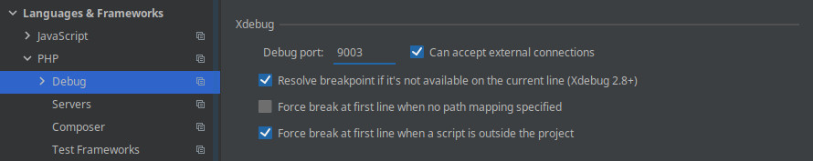
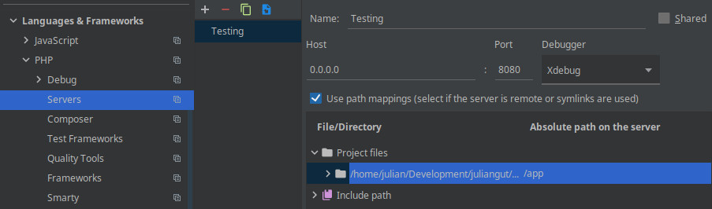

[](https://hub.docker.com/r/juliangut/phpdev/)
[](https://hub.docker.com/r/juliangut/phpdev/builds/)
[](https://microbadger.com/images/juliangut/phpdev)

[](https://hub.docker.com/r/juliangut/phpdev/)
[](https://hub.docker.com/r/juliangut/phpdev/)

# PHP development Docker image

Yet another PHP/PHP-FPM Docker image for development (based on Alpine Linux for minimal size)

Bundled with:

* UTC timezone
* Latest XDebug configured and enabled for remote debugging
* Global Composer installation
* Additionally installed PHP extensions
  * [Multibyte String](http://php.net/manual/en/book.mbstring.php)
  * [cURL](http://php.net/manual/en/book.curl.php)
  * [OpenSSL](http://php.net/manual/en/book.openssl.php)
  * [Zlib](http://php.net/manual/en/book.zlib.php)
  * [BCMath](http://php.net/manual/en/book.bc.php)
  * [GD](http://php.net/manual/en/book.image.php)
  * [OPcache](http://php.net/manual/en/book.opcache.php)

#### Focused on library/package development

## Available tags

#### CLI
* `5.6`, `5` _([5.6/5/Dockerfile](https://github.com/juliangut/docker-phpdev/blob/master/dist/php/5.6/Dockerfile))_ - docker pull juliangut/phpdev:5.6
* `7.0` _([7.0/Dockerfile](https://github.com/juliangut/docker-phpdev/blob/master/dist/php/7.0/Dockerfile))_ - docker pull juliangut/phpdev:7.0
* `7.1` _([7.1/Dockerfile](https://github.com/juliangut/docker-phpdev/blob/master/dist/php/7.1/Dockerfile))_ - docker pull juliangut/phpdev:7.1
* `7.2`, `7`, `latest` _([7.2/7/latest/Dockerfile](https://github.com/juliangut/docker-phpdev/blob/master/dist/php/7.2/Dockerfile))_ - docker pull juliangut/phpdev:7.2

#### PHP-FPM

* `5.6-fpm`, `5-fpm` _([5.6-fpm/5-fpm/Dockerfile](https://github.com/juliangut/docker-phpdev/blob/master/dist/fpm/5.6/Dockerfile))_ - docker pull juliangut/phpdev:5.6-fpm
* `7.0-fpm` _([7.0-fpm/Dockerfile](https://github.com/juliangut/docker-phpdev/blob/master/dist/fpm/7.0/Dockerfile))_ - docker pull juliangut/phpdev:7.0-fpm
* `7.1-fpm` _([7.1-fpm/Dockerfile](https://github.com/juliangut/docker-phpdev/blob/master/dist/fpm/7.1/Dockerfile))_ - docker pull juliangut/phpdev:7.1-fpm
* `7.2-fpm`, `7-fpm`, `fpm-latest` _([7.2-fpm/7-fpm/fpm-latest/Dockerfile](https://github.com/juliangut/docker-phpdev/blob/master/dist/fpm/7.2/Dockerfile))_ - docker pull juliangut/phpdev:7.2-fpm

## Environment variables

#### USER_UID

* **Only for PHP-FPM versions**
* Type: int
* Default: not set
* _Recommended_

In order to avoid file access problems it is recommended to set this variable to your user's UID. You can find your UID by running `id -u`

#### USER_GID

* **Only for PHP-FPM versions**
* Type: int
* Default: not set
* _Recommended_

In order to avoid file access problems it is recommended to set this variable to your user's GID. You can find your GID by running `id -g`

#### XDEBUG_DISABLE

* Type: int
* Default: 0

Disable xDebug by setting a non zero value

#### XDEBUG_REMOTE_HOST

* Type: string
* Default: auto discovered host's ip

Remote server (host) IP to connect to

#### XDEBUG_REMOTE_PORT

* Type: integer
* Default: 9000

Remote server port to connect to, IDE should be listening on this port

#### XDEBUG_REMOTE_AUTOSTART

* Type: integer
* Default: 0
* _Not recommended_

Auto start remote debugging.

#### XDEBUG_IDE_KEY

* Type: string
* Default: not set
* _Not recommended_

Fixed remote session identifier.

_Note: escape the string for use in sed_

#### XDEBUG_FILE_LINK_FORMAT

* Type: string
* Default: not set

Protocol format to integrate IDEs with stack trace file links. You can provide your custom format or use one of the supported formats: "phpstorm", "idea", "sublime", "textmate", "emacs" or "macvim"

_Note: if you use your custom format remember to escape the string for use in "sed" command_

## Volumes

#### /app

The default working directory. You should mount your project root path in this volume.

#### /var/log/php

Logging volume for PHP and PHP-FPM logs and xDebug log, profile and trace files.

## Usage

### Getting the image

```bash
docker pull juliangut/phpdev:latest

docker pull juliangut/phpdev:fpm-latest
```

### Running a container

```bash
docker run -it --rm -v `pwd`:/app juliangut/phpdev:latest

docker run -d -e USER_UID=`id -u` -e USER_GID=`id -g` -v `pwd`:/app juliangut/phpdev:fpm-latest
```

#### Running built-in server

```bash
docker run -d -p 8080:8080 -v `pwd`:/app juliangut/phpdev:latest php -S 0.0.0.0:8080 -t /app/public
```

##### With Docker Compose

```yaml
version: "2"

services:
  app:
    image: juliangut/phpdev:latest
    ports:
      - 8080:8080
    volumes:
      - .:/app
    command: "php -S 0.0.0.0:8080 -t /app/public"
```

```bash
docker-compose up
```

_Access running server on "http://localhost:8080"_

#### Running a composer command

```bash
docker run --rm -v `pwd`:/app juliangut/phpdev:latest composer [command]
```

#### Accessing a running container

```bash
docker exec -it [container_id] /bin/bash
```

### Using xDebug

It is **not recommended** to have a fixed remote session identifier and an auto-started remote session using "XDEBUG_IDE_KEY" and "XDEBUG_REMOTE_AUTOSTART" environment variables respectively.

The preferred way of starting a remote debug session is by setting remote session identifier dynamically by one of the following means:

* On browser by setting "XDEBUG_SESSION" cookie with the session identifier as its value
* On HTTP request (cURL) by adding "XDEBUG_SESSION_START" parameter to the URI or as a POST parameter. eg: `curl -X POST -F "XDEBUG_SESSION_START=PHPSTORM" http://example.local`

##### xDebug profiler

To activate the profiler set "XDEBUG_PROFILE" cookie. Profile `cachegrind.out.*` files will be saved into `/var/log/php` directory

##### xDebug trace

To activate the trace set "XDEBUG_TRACE" cookie. Trace `*.xt` files will be saved into `/var/log/php` directory

#### Browser support

There are [browser plugins/extensions](https://xdebug.org/docs/remote#starting) to toggle these debug cookies easily

#### Debugging with PHPStorm

##### Review xDebug configuration



* Port must be the same previously defined in `XDEBUG_REMOTE_PORT` environment variable
* If you're using PHP_FPM image version remember port 9000 has already been taken by PHP-FPM itself, use 9001 or any other you please instead

##### Create a server



* Server name will be used later so make it stand out
* Host and port must be the same set in built-in server. You you can use "0.0.0.0" to allow any host
* Map your project root to container location (/app)

##### Start listening for xDebug connections

Click the phone icon to start listening for incoming connections and create a breakpoint


##### Start the container

Setting `PHP_IDE_CONFIG` environment variable to the server name you defined earlier

```bash
docker run -d -p 8080:8080 -e PHP_IDE_CONFIG="serverName=Test" -e XDEBUG_FILE_LINK_FORMAT=phpstorm -v `pwd`:/app juliangut/phpdev:latest php -S 0.0.0.0:8080 -t /app/public
```

##### Using Docker Compose

```yaml
version: "2"

services:
  app:
    image: juliangut/phpdev:latest
    ports:
      - 8080:8080
    environemnt:
      PHP_IDE_CONFIG: serverName=Test
      XDEBUG_FILE_LINK_FORMAT: phpstorm
    volumes:
      - .:/app
    command: "php -S 0.0.0.0:8080 -t /app/public"
```

```bash
docker-compose up
```

##### Firewalld & NetworkManager notice

By default firewalld blocks all outgoing connections from docker containers, such as xDebug connection to port 9000 on host. In order to allow docker containers to connect with xDebug server you need to include `docker0` interface into a "trusted" zone both on NetworkManager and firewalld:

Assign docker0 interface to "trusted" zone and stop NetworkManager service
```
nmcli connection modify docker0 connection.zone trusted
systemctl stop NetworkManager.service
```

Assign "trusted" zone for docker0 interface on firewalld. Additionally 172.0.0.0/8 source is added to cover any created docker network

```
firewall-cmd --permanent --zone=trusted --change-interface=docker0
firewall-cmd --permanent --zone=trusted --add-source=172.0.0.0/8
firewall-cmd --reload
```

Restart NetworkManager and reassign docker0 interface just in case
```
systemctl start NetworkManager.service
nmcli connection modify docker0 connection.zone trusted
```

Restart docker service so it recreates its iptables
```
systemctl restart docker.service
```

## Extending the image

The image comes with just the minimum PHP extensions, you most probably will need more.

```
FROM juliangut/phpdev:latest

RUN docker-php-ext-install \
    pdo_mysql \
  && pecl install \
    mongodb \
    redis \
  && docker-php-ext-enable \
    mongodb \
    redis \

RUN composer global require phpunit/phpunit
```

## License

See file [LICENSE](https://github.com/juliangut/docker-phpdev/blob/master/LICENSE) included with the source code for a copy of the license terms.
